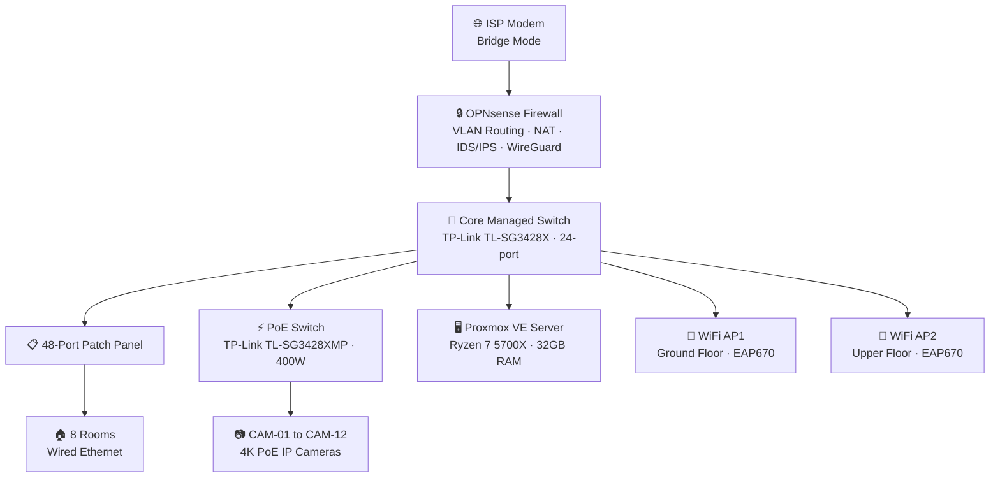
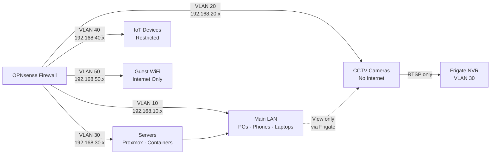
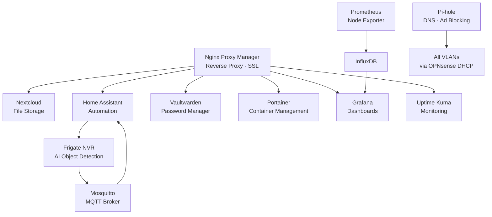

# Network Topology Diagram

The following diagrams are written in [Mermaid](https://mermaid.js.org/) and will render natively in GitHub.

---

## Full Network Topology

---

## VLAN Segmentation

---

## Container Service Map

---

## Build Priority Sequence

```mermaid
gantt
    title Home Lab Build Phases
    dateFormat  X
    axisFormat  Phase %s

    section Foundation
    Server + Proxmox        :done, 1, 2
    OPNsense Firewall       :done, 2, 3
    Core Switch + Cabling   :done, 3, 4
    UPS                     :done, 4, 5

    section Core Services
    CCTV + Frigate          :active, 5, 6
    WiFi APs + Controller   :active, 6, 7

    section Security & Resilience
    WireGuard VPN           :7, 8
    Offsite Backup          :8, 9

    section Observability
    Monitoring Stack        :9, 10

    section Advanced
    PiKVM                   :10, 11
    10GbE Backbone          :11, 12
```

